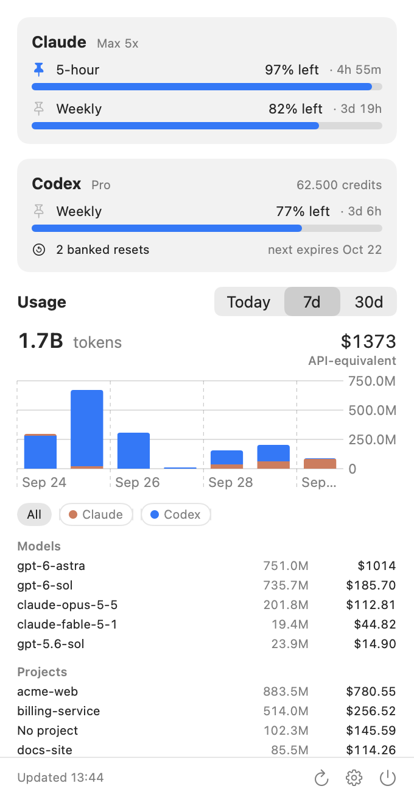

# Tinybar

**A tiny, fully native macOS menu bar app for your AI subscriptions. What's left of your Claude,
Codex, Gemini and Cursor limits, the tokens you burned, and what they would have cost at API prices, in about 20 MB of
RAM.**

<p align="center">
  
  
  <a href="LICENSE">
    </a>
  
</p>

AppKit and SwiftUI, **zero third-party dependencies**, no Electron, no WebViews and no telemetry.
Tinybar is a from-scratch alternative to [CodexBar](https://github.com/steipete/CodexBar), built
around one idea: a status item should cost nothing while you're not looking at it.

<p align="center">
  <picture>
    <source media="(prefers-color-scheme: dark)" srcset="docs/screenshot-dark.png">
    
  </picture>
</p>

## Features

- **Limits, as what's left** — the 5-hour and weekly windows for Claude, Codex and Gemini (via
  Antigravity), and Cursor's billing cycle, counting down from 100% to 0%, with reset countdowns.
  Model-scoped limits, Claude extra usage, Cursor on-demand spend, Codex credits and **banked
  resets** included.
- **One overview, one page per subscription** — the overview shows each subscription as rings and
  the limit closest to running out, plus usage across all of them; click a row (or press 1–4) for its limits, resets, extras and
  usage. Everything is one click away.
- **Menu bar at a glance** — a ring and a percentage for the one window you pin. Click any limit on a
  subscription's page to pin it.
- **Token history** — Today, 7 days and 30 days, read from the local Claude Code and Codex logs
  (Gemini and Cursor show limits only),
  with a daily chart and the top models and projects.
- **Theoretical cost** — what those tokens would have cost at public API prices, from
  [models.dev](https://models.dev).
- **Per-subscription usage** — each subscription's page shows only its tokens, cost, chart, models
  and projects.
- **Projects from git** — usage is attributed to the repository it happened in; worktrees count as
  their main repo.
- **Limit alerts** — a notification at 90% and 95% of a 5-hour or weekly window, and when a window
  you nearly used up resets.
- **History that outlives the logs** — daily totals live in a small local database, so they survive
  Claude Code deleting transcripts after 30 days.
- **Browser fallback** — optional, per provider: if a CLI login is missing or expired, read your
  signed-in browser session instead.

## Safe by design

Tinybar only ever **reads**. It uses the logins your official CLIs already store and calls the same
read-only endpoints they call for `/usage` and `/status`:

| Provider | Limits | Token history |
| -------- | ------ | ------------- |
| Claude   | Claude Code's OAuth login (`~/.claude/.credentials.json` or the `Claude Code-credentials` Keychain item) → `api.anthropic.com/api/oauth/usage` | `~/.claude/projects/**/*.jsonl` |
| Codex    | `~/.codex/auth.json` → `chatgpt.com/backend-api/wham/usage`, falling back to a short-lived `codex app-server` in read-only mode | `~/.codex/sessions`, `~/.codex/archived_sessions` |
| Gemini   | a short-lived `agy -p /usage` (Antigravity CLI's built-in usage report: no prompt, no tokens spent) | — |
| Cursor   | Cursor.app's login (`state.vscdb`), else the `cursor.com` session cookie in your browser → `cursor.com/api/usage-summary` | — |

It **never refreshes or rewrites a token**, never sends a prompt, and never redeems a banked reset.
When a login expires the card turns **stale** and tells you to run `claude`, `codex` or `agy` once
(or open Cursor); the client renews its own login. Why this matters and what it costs:
[ADR 0001](docs/adr/0001-read-only-credentials.md).

The only other network call is one unauthenticated GET to `models.dev/api.json`, at most once a day.

## Performance

Measured on an Apple silicon Mac with 16 GB of Codex logs (100k files) and 8 GB of Claude
transcripts:

| | |
| --- | --- |
| Idle CPU | 0.0% — one 5-minute poll, no animations, no timers faster than that |
| Idle memory | ~20 MB footprint |
| Keeping up | FSEvents reports which log files changed; only appended bytes are read |
| First launch | the whole history imports in about two minutes, in a child process that exits when done |

## Install

Not packaged yet. Homebrew, a notarized build and auto-updates are on the way. Until then, build
it yourself:

```sh
git clone https://github.com/ThiloReintjes/tinybar.git
cd tinybar
./Scripts/build-app.sh
open build/Tinybar.app
```

Tinybar starts at login by default. On first launch it finds the CLIs you're signed in to and turns
those providers on. There's nothing to configure.

## Permissions

- **Notifications** — asked once, for limit alerts. Turn alerts off in Settings any time.
- **Keychain** — Claude's login is read through `/usr/bin/security`, the tool Claude Code itself
  uses to store it, so there is no prompt. The **browser fallback** is off by default, and so is
  Cursor unless Cursor.app is signed in: turning either on for a Chromium browser (Chrome, Arc, Dia, Brave, Edge, Comet) asks once for that browser's
  "Safe Storage" key. Firefox needs nothing; Safari isn't supported.

## Building from source

Swift 6 toolchain (Xcode 16 or newer), macOS 14+. Plain SwiftPM, no Xcode project.

```sh
swift build                  # debug build
swift test                   # unit tests
./Scripts/build-app.sh       # universal, ad-hoc signed build/Tinybar.app
```

Developer tools:

```sh
swift run tinybar-cli limits [--browser]   # fetch limits for all four providers
swift run tinybar-cli cookies              # which browser holds session cookies
swift run tinybar-cli ingest [db]          # ingest Claude + Codex logs
swift run tinybar-cli usage [db]           # print usage summaries
.build/debug/Tinybar --snapshot out.png [--page claude|settings]  # render to PNG, light and dark
```

[SPEC.md](SPEC.md) is the v1 scope, [CONTEXT.md](CONTEXT.md) the vocabulary (Limit Window, Banked
Reset, Theoretical Cost, …), and [docs/adr/](docs/adr) the decisions behind them.

## Contributing

> [!IMPORTANT]
> **Open an issue before you write code.** Get the bug or feature agreed first. Tinybar stays small on
> purpose: "CodexBar has it" is not a reason on its own, and new providers are added one at a time,
> only when someone actually uses them.

Read **[CONTRIBUTING.md](CONTRIBUTING.md)** first. It covers the performance budget every change is
held to and the read-only rule for credentials. Security issues go through
[SECURITY.md](SECURITY.md), not the issue tracker.

## License

[MIT](LICENSE)
